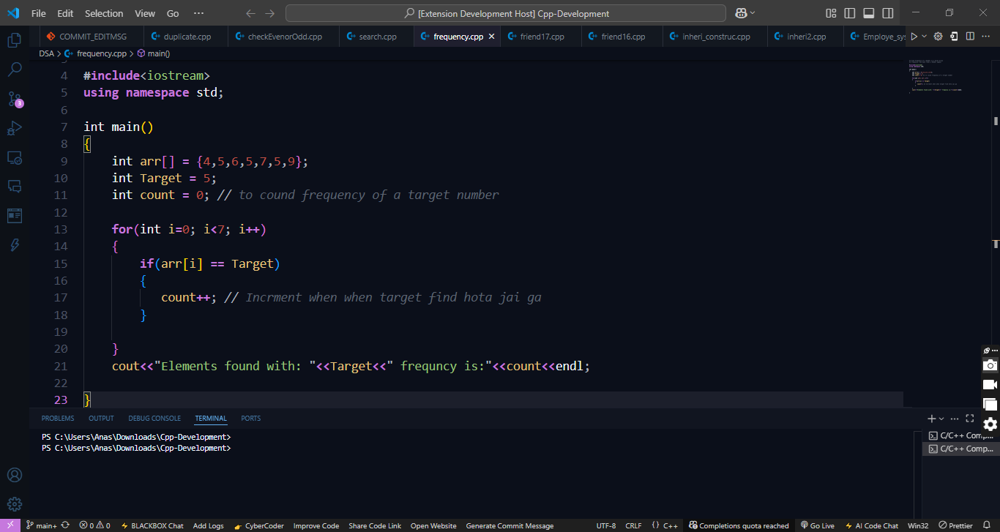
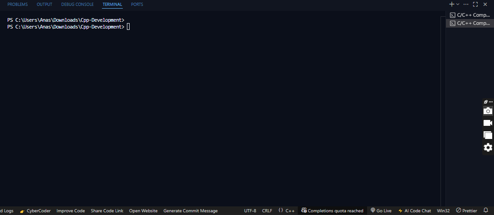
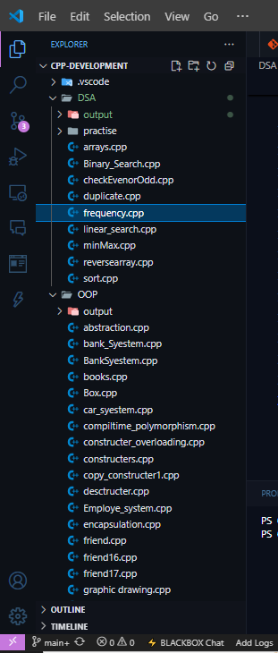

# ☕ BlackCoffeeDark — A Deep Dark Theme for Developers

**BlackCoffeeDark** is a rich, immersive Visual Studio Code theme designed for passionate developers who love coding at midnight with a cup of coffee in hand.

---

## 📷 Screenshots

### ✨ Syntax Highlighting (C++)

### 💻 Sidebar + Terminal UI

### 🌐 Terminal Example

### ⚙️ SideBar

---

## ✨ Why You'll Love It

- ✅ **Deep dark background** to reduce eye strain  
- 🎨 **Warm and vivid syntax colors** for JavaScript, Python, HTML, CSS, Dart, C++, and more  
- 🧠 **Minimal distractions** — perfect for focus and flow  
- 💻 **Stylish UI elements** including sidebar, tabs, terminal, and status bar  
- ☕ **Coffee-inspired color palette** for a cozy developer vibe  
- 🖼️ Includes a custom-designed icon for that polished feel  

---

## 💡 Inspiration

> _"Some code, some coffee, some dark vibes."_  
> This theme was crafted to blend aesthetics with usability — inspired by long nights, glowing terminals, and the quiet power of focused flow.

---

## 🖥️ Language Support

Looks stunning in:

- JavaScript / TypeScript  
- Python  
- HTML & CSS  
- Dart / Flutter  
- C, C++, Java  
- JSON, Markdown, Shell  
- And many more!

---

## 🚀 Installation

1. Clone or download this repository  
2. Open it in Visual Studio Code  
3. Press `F5` to launch the **Extension Development Host**  
4. In the new window:  
   `Ctrl + Shift + P` → `Color Theme` → Choose **BlackCoffeeDark**

---

## 🧠 Designed By

**Malik Ahmad Rasheed**  
Developer • Full Stack Developer • Code Themer

> “Don’t just code — make it beautiful.”

---

## 📫 Connect

- GitHub: [https://github.com/ahmaddii]
- Linkden: [https://www.linkedin.com/in/malik-ahmad-rasheed-3768902a9/]
- Feedback: [malikahmad6666666@gmail.com or feedback form]

---

Made with ☕ & ❤️ for developers who live the dark mode life.
